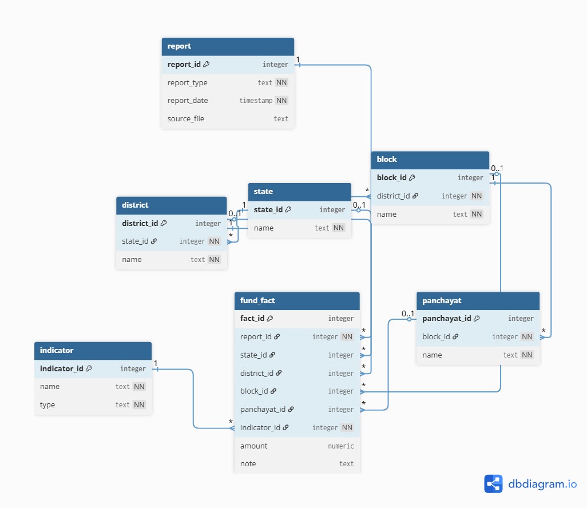

# PMAY-G Insights Dashboard

**Pradhan Mantri Awaas Yojana – Gramin (PMAY-G) Insights Dashboard** is an interactive Streamlit application that allows users to explore, query, and visualize fund allocations, utilization, and beneficiary distributions for the PMAY-G program across India at multiple hierarchical levels (state, district, block, and panchayat).

---

## Table of Contents
- [Overview](#overview)  
- [Features](#features)  
- [Data Structure](#data-structure)  
- [Installation](#installation)  
- [Usage](#usage)  
- [Project Structure](#project-structure)  
- [Future Enhancements](#future-enhancements)  
- [Acknowledgements](#acknowledgements)  

---

## Overview
PMAY-G is a flagship government initiative that provides **pucca houses with essential amenities** to eligible rural households. This project leverages official fund allocation data to help users:

- Understand allocation patterns at different administrative levels.
- Identify under- or over-represented beneficiary categories.
- Track fund utilization and efficiency.
- Ask natural-language questions and get SQL-backed insights.

---

## Features
- **Interactive Dashboard** built with Streamlit.
- **Natural Language Query Interface**: Users can ask questions about fund allocation, utilization, and beneficiaries.
- **Dynamic SQL Generation** using a text-to-SQL agent.
- **Insights Generation**: Contextual summaries of query results.
- **Multi-level Hierarchical Data Exploration**:  
  - State  
  - District  
  - Block  
  - Panchayat
- **Example Questions** to guide users.
- **Excel Data Integration** for easy updates.

---

## Data Structure
Data is structured in Excel files and organized by administrative level:

| Level | Filename Format | Description |
|-------|----------------|-------------|
| Country | `02_states.xlsx` | Contains national-level fund allocations and releases for the country |
| State | `02_<state_name>_districts.xlsx` | Contains district-level fund allocations for the state |
| District | `03_<district_name>_blocks.xlsx` | Contains block-level fund allocations for the district |
| Block | `04_<block_name>_panchayats.xlsx` | Contains panchayat-level fund allocations for the block |

## E-R Diagram


**Indicators** include:  
- Beneficiary: SC, ST, Minority, Others, Total  
- Fund Flow: Allocated_Total, Released_Total, Total Available Funds, Utilization of Funds, Percentage Utilization  

> All numeric values are expressed in **lakhs**.

---

## Installation

1. **Clone the repository**  
```bash
git clone https://github.com/yourusername/pmayg-dashboard.git
cd pmayg-dashboard
```

2. **Create a virtual environment**  
```bash
python -m venv venv
source venv/bin/activate  # Linux/macOS
venv\Scripts\activate     # Windows
```

3. **Install dependencies**  
```bash
pip install -r requirements.txt
```

4. **Set up PostgreSQL database** and create a `.env` file with credentials:  
```
DB_HOST=<host>
DB_PORT=<port>
DB_NAME=<database_name>
DB_USER=<username>
DB_PASS=<password>
```

5. **Prepare Excel files** in the `excel/` folder as per the data structure above.

6. **Populate the database**  
```bash
python db/load_data.py
```

---

## Usage

Run the Streamlit dashboard:  
```bash
streamlit run app.py
```

### Pages
1. **Home** – Overview of PMAY-G and the dashboard purpose.
2. **Ask a Question** – Enter natural language queries, generate SQL, execute, and view insights.
3. **View Data** – Browse uploaded Excel sheets for state, district, block, and panchayat levels.

---

## Project Structure
```
pmayg-dashboard/
│
├─ agents/
│  ├─ text_to_sql.py
│  ├─ query_executor.py
│  ├─ insight_generator.py
│  └─ summary_agent.py
│
├─ few_shot_examples/
│  └─ examples.py
│
├─ db/
│  ├─ excel/
│  │  ├─ 01_states.xlsx
│  │  ├─ 02_maharashtra_districts.xlsx
│  │  ├─ 03_pune_blocks.xlsx
│  │  └─ 04_khed_panchayats.xlsx
│  └─ setup.py
│
├─ utils/
│  ├─ sql_validator.py
│  └─ state.py
│
├─ app.py
├─ requirements.txt
└─ README.md
```

---

## Future Enhancements
- Add **dynamic visualizations** (bar charts, heatmaps) for allocations and utilization.
- Include **trend analysis over multiple years**.
- Enable **multi-state and multi-district comparisons**.
- Integrate **alerts for anomalies** in fund utilization.

---

## Acknowledgements
- Data Source: [Ministry of Rural Development, India](https://rhreporting.nic.in/netiay/FinancialProgressReport/Report_HighLevel_FinancialProgress.aspx)  
- Built using: Python, Streamlit, Pandas, PostgreSQL